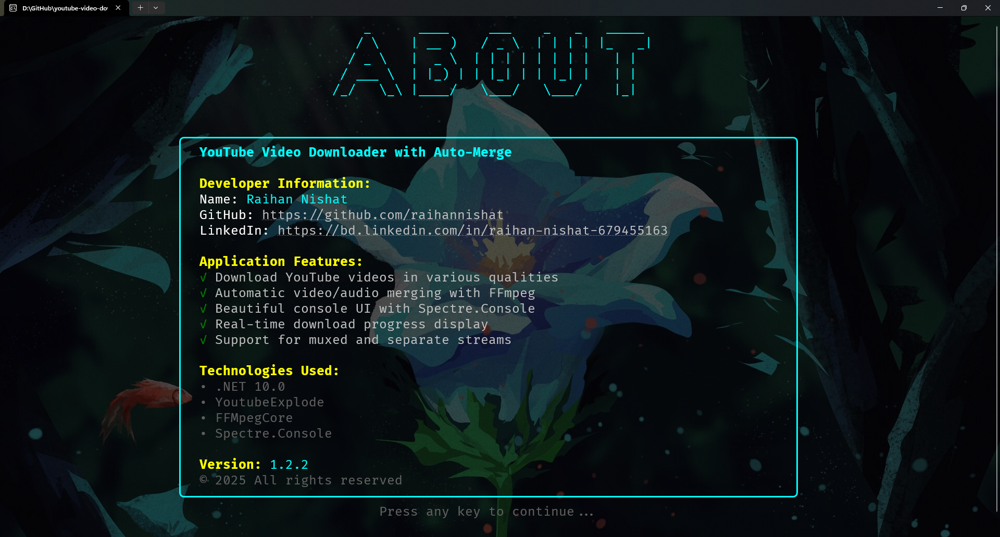
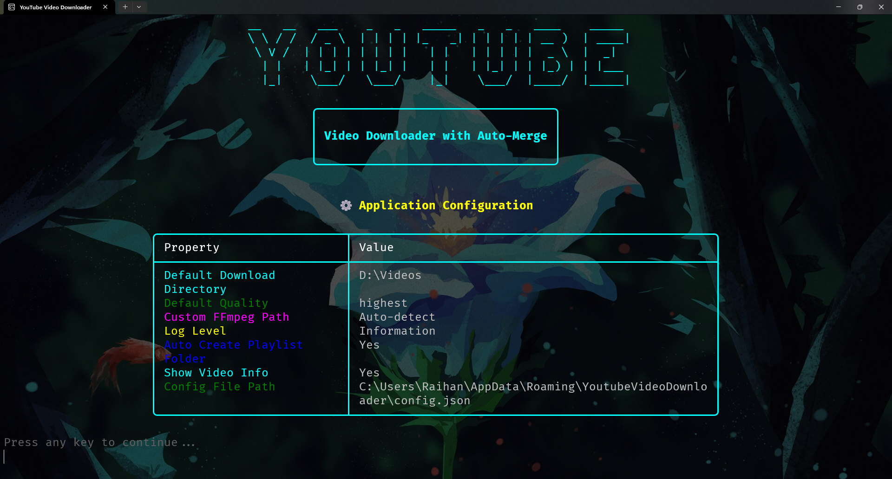
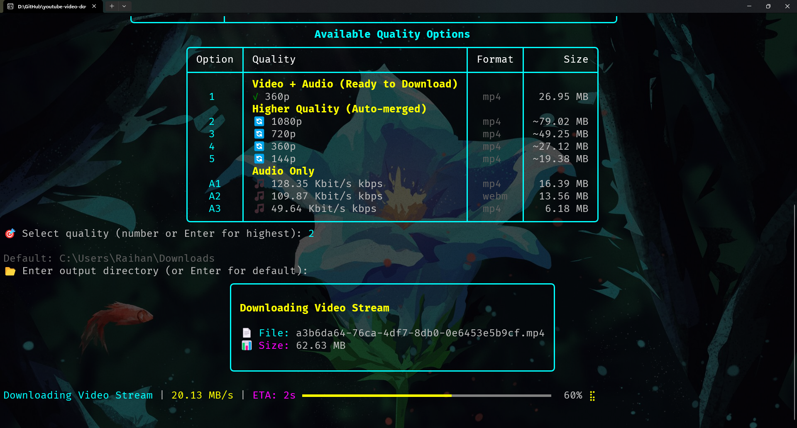
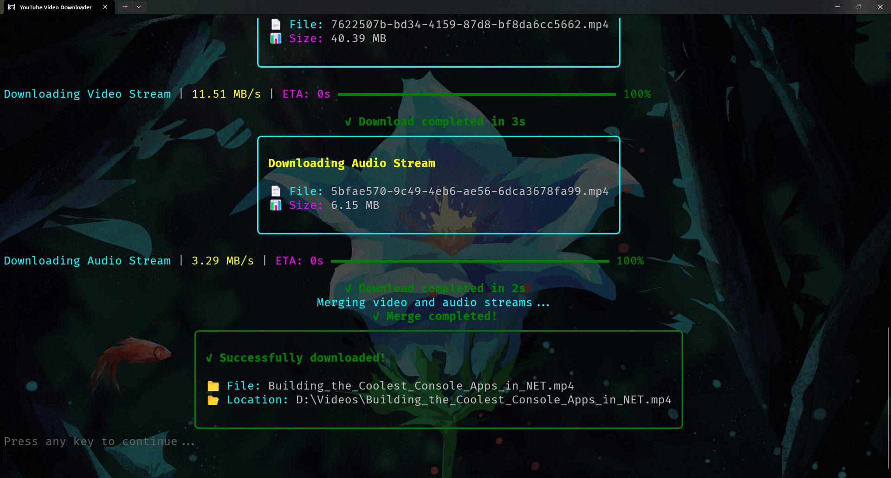
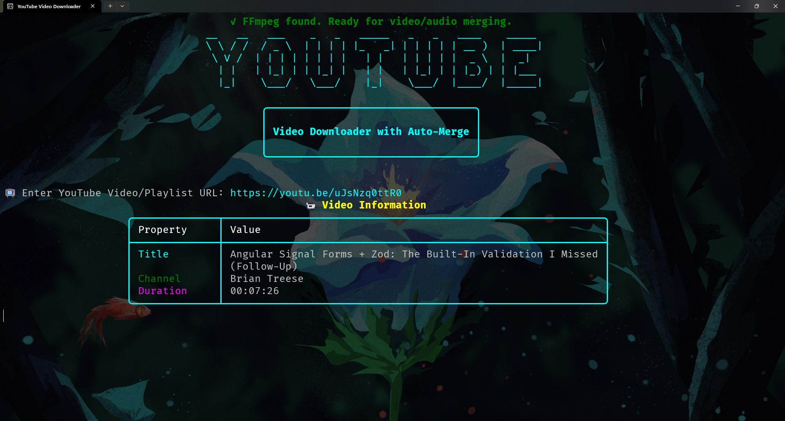
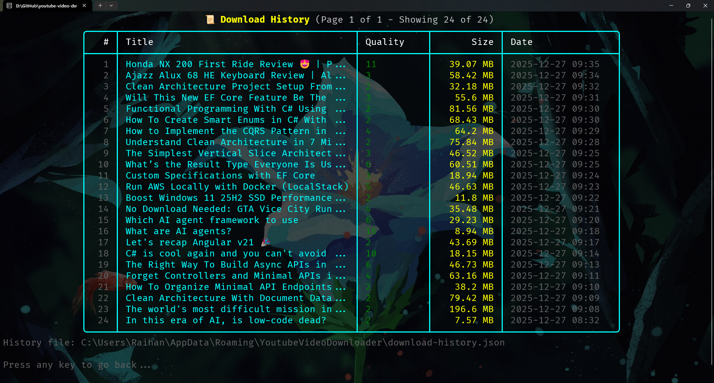
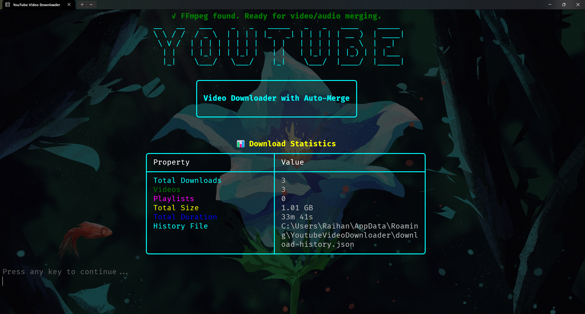

# YouTube Video Downloader

A powerful, feature-rich console-based YouTube video downloader built with C# and .NET 10. This application allows you to download YouTube videos in various qualities with automatic video/audio merging capabilities.

## 📋 Table of Contents

- [Screenshots](#-screenshots)
- [Download](#-download)
- [Features](#features)
- [Technologies Used](#technologies-used)
- [Prerequisites](#prerequisites)
- [Installation](#installation)
- [Creating Installer](#creating-installer)
- [Usage](#usage)
- [Architecture](#architecture)
- [Project Structure](#project-structure)
- [Testing](#testing)
- [Configuration](#-configuration)
- [Download History](#-download-history)
- [Logging](#-logging)
- [Developer Information](#developer-information)
- [License](#license)

## 📸 Screenshots

#### 1. Home Screen


*Main application interface showing the welcome screen with ASCII art header and URL input prompt with all available commands.*

#### 2. About Page



*Access the about page by typing 'a' or 'i' when prompted for a URL. The about page displays developer information, application features, technologies used, and version details.*

#### 3. Configuration Menu



*Configuration menu accessible by typing 'c' or 'C'. View, edit, or reset application settings including default download directory, quality preferences, and logging options.*

#### 4. Download Progress



*Real-time download progress display with IDM-style progress bar showing download speed, percentage, ETA, and file information.*

#### 5. Successfully Downloaded



*Download completion confirmation showing the downloaded file path, size, and location.*

#### 6. Video Quality Options



*Available video quality options displayed in a formatted table showing muxed streams, video-only streams, and audio-only options with file sizes.*

#### 7. Download History



*Download history view showing a paginated list of all downloaded videos with title, quality, size, and download date. Access by typing 'h' or 'H'.*

#### 8. Download Statistics



*Comprehensive download statistics showing total downloads, videos vs playlists breakdown, total size, total duration, and history file location.*

## 📥 Download

### Quick Download (Recommended)

Download the pre-built installer for Windows:

- **📦 Installer**: [Download YouTube Video Downloader v1.2.2](https://github.com/raihannishat/youtube-video-downloader/releases/latest/download/YouTubeVideoDownloader-Setup-v1.2.2.exe) (Direct Download)
  - File: `YouTubeVideoDownloader-Setup-v1.2.2.exe`
  - Size: ~70-100 MB (includes .NET runtime)
  - No additional dependencies required
  - **Direct download**: Click the link above to automatically download the installer
  - **Alternative**: Visit [Releases Page](https://github.com/raihannishat/youtube-video-downloader/releases/latest) for release notes and other download options

### Build from Source

If you prefer to build from source, see the [Installation Guide](#-installation-guide) section below.

**Note**: After downloading the installer, run it and follow the installation wizard. The installer will automatically set up all required components.

### System Requirements

- **OS**: Windows 10/11 (64-bit)
- **RAM**: 2 GB minimum
- **Disk Space**: 200 MB for installation
- **Internet**: Required for downloading videos and FFmpeg setup

## ✨ Features

- **🎥 Multiple Quality Options**: Download videos in various resolutions (360p, 480p, 720p, 1080p, etc.)
- **🔀 Automatic Merging**: Automatically merges separate video and audio streams for higher quality downloads
- **🎵 Audio-Only Downloads**: Download audio-only streams in various bitrates
- **📊 Real-Time Progress**: IDM-style progress display with download speed, percentage, and ETA
- **🎨 Beautiful UI**: Modern console interface using Spectre.Console with centered content and ASCII art
- **🔧 Auto FFmpeg Setup**: Automatically downloads and configures FFmpeg if not found
- **📝 File Logging**: Comprehensive logging using Serilog with daily rolling log files
- **🏗️ Clean Architecture**: Vertical Slice Architecture with Dependency Injection
- **✅ Unit Tests**: Comprehensive unit test coverage with xUnit and FluentAssertions
- **🌐 URL Normalization**: Automatically handles YouTube URLs with or without protocol
- **⚙️ Configuration File**: Persistent configuration with JSON-based settings
- **📋 Playlist Download**: Download entire playlists with automatic folder creation
- **📁 Custom Output Directory**: Choose custom download locations
- **📄 Batch Download**: Download multiple videos/playlists from a file or direct URLs
- **📜 Download History**: Track all downloads with detailed information and statistics
- **📑 Paged History View**: Browse download history with 25 entries per page navigation


## 🛠️ Technologies Used

- **.NET 10.0** - Latest .NET framework
- **YoutubeExplode (6.5.6)** - YouTube video metadata and stream extraction
- **FFMpegCore (5.1.0)** - FFmpeg wrapper for video/audio merging
- **Spectre.Console (0.54.1-alpha.0.10)** - Beautiful console UI components
- **Serilog (4.1.0)** - Structured logging framework
- **Serilog.Sinks.File (6.0.0)** - File logging sink
- **Microsoft.Extensions.DependencyInjection (10.0.0)** - Dependency injection container
- **xUnit (2.9.2)** - Unit testing framework
- **Moq (4.20.72)** - Mocking framework for unit tests
- **FluentAssertions (7.0.0)** - Fluent assertion library

## 📦 Prerequisites

- **.NET 10.0 SDK** or later
- **Windows OS** (FFmpeg auto-download is configured for Windows)
- **Internet Connection** (for downloading videos and FFmpeg setup)
- **Git** (optional, for cloning the repository)

## 🚀 Installation Guide

This guide will walk you through installing everything needed to run the YouTube Video Downloader application.

### Step 1: Install .NET 10.0 SDK

The application requires .NET 10.0 SDK to build and run. Follow these steps:

#### Option A: Download from Microsoft (Recommended)

1. **Visit the .NET Download Page**
   - Go to: [https://dotnet.microsoft.com/download/dotnet/10.0](https://dotnet.microsoft.com/download/dotnet/10.0)

2. **Download .NET 10.0 SDK**
   - Click on **".NET 10.0 SDK"** (not just Runtime)
   - Select your operating system (Windows x64)
   - Download the installer

3. **Run the Installer**
   - Double-click the downloaded installer
   - Follow the installation wizard
   - Accept the license agreement
   - Click **Install**
   - Wait for installation to complete

4. **Verify Installation**
   - Open Command Prompt or PowerShell
   - Run the following command:
   ```bash
   dotnet --version
   ```
   - You should see version `10.0.x` or higher
   - If you see an error, restart your terminal or computer

#### Option B: Install via Winget (Windows Package Manager)

If you have Winget installed:

```bash
winget install Microsoft.DotNet.SDK.10
```

#### Option C: Install via Chocolatey

If you have Chocolatey installed:

```bash
choco install dotnet-10.0-sdk
```

### Step 2: Install Git (Optional - Only if cloning from GitHub)

If you want to clone the repository, you'll need Git:

1. **Download Git**
   - Visit: [https://git-scm.com/download/win](https://git-scm.com/download/win)
   - Download the Windows installer

2. **Install Git**
   - Run the installer
   - Use default settings (recommended)
   - Complete the installation

3. **Verify Installation**
   ```bash
   git --version
   ```

### Step 3: Clone the Repository

#### Option A: Using Git (Recommended)

1. **Open Command Prompt or PowerShell**

2. **Navigate to your desired directory**
   ```bash
   cd C:\Users\YourName\Documents
   ```

3. **Clone the repository**
   ```bash
   git clone https://github.com/raihannishat/youtube-video-downloader.git
   ```

4. **Navigate to the project directory**
   ```bash
   cd youtube-video-downloader\YoutubeVideoDownloader
   ```

#### Option B: Download as ZIP

1. **Visit the GitHub Repository**
   - Go to: [https://github.com/raihannishat/youtube-video-downloader](https://github.com/raihannishat/youtube-video-downloader)

2. **Download ZIP**
   - Click the green **"Code"** button
   - Select **"Download ZIP"**
   - Extract the ZIP file to your desired location

3. **Navigate to the project directory**
   ```bash
   cd path\to\extracted\folder\youtube-video-downloader\YoutubeVideoDownloader
   ```

### Step 4: Restore NuGet Packages

The first time you open the project, restore all NuGet packages:

```bash
dotnet restore
```

This will download all required packages (YoutubeExplode, FFMpegCore, Spectre.Console, etc.)

### Step 5: Build the Project

Build the project to compile the application:

```bash
dotnet build
```

**Expected Output:**
```
Build succeeded.
    0 Warning(s)
    0 Error(s)
```

If you see errors, make sure:
- .NET 10.0 SDK is properly installed
- You're in the correct directory
- Internet connection is active (for NuGet packages)

### Step 6: Run the Application

#### Option A: Run from Source (Development)

```bash
dotnet run --project src/YoutubeVideoDownloader.Console/YoutubeVideoDownloader.Console.csproj
```

#### Option B: Build and Run Executable

1. **Build a Release version**
   ```bash
   dotnet build --configuration Release
   ```

2. **Run the executable**
   ```bash
   .\src\YoutubeVideoDownloader.Console\bin\Release\net10.0\YoutubeVideoDownloader.Console.exe
   ```

#### Option C: Publish Standalone Application

Create a standalone executable that doesn't require .NET runtime:

```bash
dotnet publish src/YoutubeVideoDownloader.Console/YoutubeVideoDownloader.Console.csproj -c Release -r win-x64 --self-contained true
```

The executable will be in:
```
src\YoutubeVideoDownloader.Console\bin\Release\net10.0\win-x64\publish\YoutubeVideoDownloader.Console.exe
```

### Step 7: First Run Setup

When you run the application for the first time:

1. **FFmpeg Auto-Setup**
   - The application will check for FFmpeg
   - If not found, it will automatically download and configure FFmpeg
   - This is a one-time process (approximately 50-100 MB download)
   - FFmpeg will be stored in the application directory

2. **Configuration File**
   - Configuration file will be created in `%AppData%\YoutubeVideoDownloader\config.json`
   - Default settings are automatically configured
   - You can customize settings via the configuration menu (type `c` in the app)

3. **Log Files**
   - Log files will be created in `logs/` directory
   - Logs are automatically rotated daily

### Step 8: Verify Installation

To verify everything is working:

1. **Run the application**
   ```bash
   dotnet run --project src/YoutubeVideoDownloader.Console/YoutubeVideoDownloader.Console.csproj
   ```

2. **Test with a YouTube URL**
   - Enter a YouTube video URL when prompted
   - The application should display video information
   - You should see available quality options

### Troubleshooting Installation

#### Problem: `dotnet` command not found

**Solution:**
- Restart your terminal/Command Prompt
- Restart your computer
- Verify .NET SDK installation: Check `C:\Program Files\dotnet\`
- Add to PATH manually if needed

#### Problem: Build errors related to NuGet packages

**Solution:**
```bash
# Clear NuGet cache
dotnet nuget locals all --clear

# Restore packages again
dotnet restore

# Rebuild
dotnet build --no-incremental
```

#### Problem: FFmpeg download fails

**Solution:**
- Check internet connection
- Ensure firewall/antivirus isn't blocking downloads
- Manually download FFmpeg from [https://ffmpeg.org/download.html](https://ffmpeg.org/download.html)
- Place `ffmpeg.exe` in the application directory

#### Problem: Application crashes on startup

**Solution:**
- Check log files in `logs/` directory
- Verify .NET 10.0 runtime is installed
- Run with verbose logging:
  ```bash
  dotnet run --project src/YoutubeVideoDownloader.Console/YoutubeVideoDownloader.Console.csproj --verbosity detailed
  ```

### Optional: Run Tests

To verify the installation and run unit tests:

```bash
# Run all tests
dotnet test

# Run with detailed output
dotnet test --verbosity normal

# Run specific test project
dotnet test test/YoutubeVideoDownloader.Console.Tests/YoutubeVideoDownloader.Console.Tests.csproj
```

**Expected Output:**
```
Test Run Successful.
Total tests: 81
     Passed: 81
     Failed: 0
```

### Quick Start Summary

For experienced users, here's the quick installation:

```bash
# 1. Install .NET 10.0 SDK (from Microsoft website)
# 2. Clone repository
git clone https://github.com/raihannishat/youtube-video-downloader.git
cd youtube-video-downloader\YoutubeVideoDownloader

# 3. Restore and build
dotnet restore
dotnet build

# 4. Run
dotnet run --project src/YoutubeVideoDownloader.Console/YoutubeVideoDownloader.Console.csproj
```

## 📦 Creating Installer

You can create a professional Windows installer that automatically resolves all dependencies. This is perfect for distributing the application to end users.

### Quick Installer Creation

The easiest way to create an installer is using the provided build script:

```powershell
# From the root directory
.\build-installer.ps1
```

This script will:
1. ✅ Build a self-contained executable (includes .NET runtime)
2. ✅ Create a professional installer using Inno Setup
3. ✅ Bundle all dependencies automatically

**Installer Output Location**: `installer\YouTubeVideoDownloader-Setup-v1.2.2.exe`

### Installer Options

#### Option 1: Self-Contained Executable (Simplest)

Creates a single `.exe` file with all dependencies included:

```bash
cd YoutubeVideoDownloader/src/YoutubeVideoDownloader.Console
dotnet publish -c Release -r win-x64 --self-contained true -p:PublishSingleFile=true
```

**Output**: `bin/Release/net10.0/win-x64/publish/YoutubeVideoDownloader.Console.exe`

**Size**: ~70-100 MB (includes .NET runtime)

#### Option 2: Inno Setup Installer (Recommended)

Creates a professional Windows installer with:
- ✅ Start Menu shortcuts
- ✅ Desktop icon (optional)
- ✅ Uninstaller
- ✅ Dependency checking
- ✅ All dependencies auto-resolved

**Requirements**: [Inno Setup](https://jrsoftware.org/isdl.php) (free)

**Usage**:
1. Install Inno Setup
2. Open `installer.iss` in Inno Setup Compiler
3. Click "Build" → "Compile"
4. Installer will be created at: `installer\YouTubeVideoDownloader-Setup-v1.2.2.exe`

### What Gets Auto-Resolved?

- ✅ **.NET 10.0 Runtime** - Included in self-contained build
- ✅ **All NuGet Packages** - Automatically bundled
- ✅ **FFmpeg** - Auto-downloads on first run (or can be bundled)

### Adding Application Icon

To add a custom icon to your application:

1. **Create or download an icon file** (`.ico` format)
   - Recommended: [Favicon.io](https://favicon.io/) or [IconFinder](https://www.iconfinder.com/)
   - Format: `.ico` with multiple sizes (16x16, 32x32, 48x48, 256x256)
   - Place `icon.ico` in the project root directory

2. **Rebuild the application:**
   ```powershell
   .\build-installer.ps1
   ```

The icon will appear in:
- ✅ Application executable
- ✅ Installer
- ✅ Desktop shortcuts
- ✅ Start Menu shortcuts

**Note:** If icon doesn't appear after installation:
- Clean build: `dotnet clean` then rebuild
- Clear Windows icon cache (run as Admin):
  ```cmd
  taskkill /f /im explorer.exe
  del /a /q "%localappdata%\IconCache.db"
  start explorer.exe
  ```
- Delete and recreate desktop shortcut

### Creating GitHub Release

To publish the installer as a GitHub release with direct download link:

1. Build the installer using the steps above
2. Follow the guide: [CREATE-RELEASE.md](CREATE-RELEASE.md)
3. Upload the installer file to GitHub Releases
4. The direct download link will be automatically available

### Detailed Guide

For comprehensive instructions on creating installers, see [installer-guide.md](installer-guide.md).

## 💻 Usage

### Starting the Application

1. Run the application using `dotnet run` or execute the compiled binary
2. The application will display a welcome header and check for FFmpeg
3. If FFmpeg is not found, it will automatically download and configure it (one-time setup)

### Downloading Videos

1. **Enter YouTube URL**: When prompted, paste a YouTube video URL
   - Supports full URLs: `https://www.youtube.com/watch?v=VIDEO_ID`
   - Supports short URLs: `https://youtu.be/VIDEO_ID`
   - Auto-adds `https://` if protocol is missing

2. **View Video Information**: The application displays:
   - Video title
   - Channel name
   - Duration

3. **Select Quality**: Choose from available options:
   - **Muxed Streams** (Video + Audio combined) - Ready to download
   - **Higher Quality** (Separate video/audio) - Auto-merged with FFmpeg
   - **Audio Only** - Various bitrate options

4. **Download**: The application will:
   - Show real-time progress with speed and ETA
   - Automatically merge video and audio if needed
   - Save to your Downloads folder

### Commands

- **`q` or `Q`** - Quit the application
- **`a` or `i`** - Show about/information page
- **`b` or `B`** - Batch download from file or direct URLs
- **`c` or `C`** - Open configuration menu
- **`h` or `H`** - View download history
- **Enter** (empty input) - Select highest available quality

### Example

```
📺 Enter YouTube Video/Playlist URL
('q'/'Q' for quit)
('a'/'i' for about)
('b'/'B' for batch)
('c'/'C' for config)
('h'/'H' for history)
please URL : https://youtu.be/VIDEO_ID

📹 Video Information
Title: Example Video
Channel: Example Channel
Duration: 00:10:30

Available Quality Options:
1. 720p (mp4) - 120.5 MB
2. 1080p (mp4) - 250.3 MB (Auto-merged)

🎯 Select quality (number or Enter for highest): 2

Downloading Video Stream...
[████████████████████] 100% | 5.2 MB/s | ETA: 0s

Downloading Audio Stream...
[████████████████████] 100% | 2.1 MB/s | ETA: 0s

Merging video and audio streams...
✓ Merge completed!

✓ Successfully downloaded!
📁 File: Example_Video.mp4
📂 Location: C:\Users\YourName\Downloads\Example_Video.mp4
```


## 🏗️ Architecture

### Vertical Slice Architecture

The project follows **Vertical Slice Architecture**, organizing code by features rather than technical layers:

```
src/YoutubeVideoDownloader.Console/
├── Core/                    # Core business logic
│   ├── Interfaces/          # Service interfaces
│   ├── Models/              # Data models (AppConfiguration)
│   ├── Services/            # Service implementations
│   └── DependencyInjection/ # DI configuration
├── Features/                # Feature-specific handlers
│   ├── About/               # About page feature
│   ├── BatchDownload/       # Batch download feature
│   ├── Configuration/       # Configuration management
│   ├── DirectorySelection/  # Directory selection feature
│   ├── Download/            # Download feature
│   ├── DownloadHistory/     # Download history feature
│   ├── FFmpegSetup/         # FFmpeg setup feature
│   ├── Playlist/            # Playlist download feature
│   ├── StreamSelection/     # Stream selection feature
│   └── VideoInfo/           # Video info display feature
├── Common/                  # Shared utilities
│   ├── UI/                  # UI helpers
│   └── Utils/               # Utility functions
└── Infrastructure/          # Infrastructure concerns
    └── Logging/             # Logging configuration
```

### Dependency Injection

All services are registered using Microsoft.Extensions.DependencyInjection:

- **IYouTubeService** → **YouTubeService**
- **IDownloadService** → **DownloadService**
- **IFFmpegService** → **FFmpegService**
- **IDownloadAndMergeService** → **DownloadAndMergeHandler**
- **IApplicationService** → **ApplicationService**
- **ILoggerService** → **SerilogLoggerService**
- **IConfigurationService** → **ConfigurationService**
- **IDownloadHistoryService** → **DownloadHistoryService**

### Design Patterns

- **Dependency Injection**: All dependencies are injected through constructors
- **Interface Segregation**: Services are defined by focused interfaces
- **Single Responsibility**: Each class has a single, well-defined purpose
- **Separation of Concerns**: Business logic separated from infrastructure

## 📁 Project Structure

```
youtube-video-downloader/
├── README.md                    # Project documentation
├── .gitignore                   # Git ignore rules
├── icon.ico                     # Application icon
├── installer-guide.md           # Detailed installer creation guide
├── installer.iss                # Inno Setup installer script
├── build-installer.ps1          # Automated installer build script
├── CREATE-RELEASE.md            # Guide for creating GitHub releases
├── Contents/                    # Application screenshots
│   ├── 01-home.png
│   ├── 02-about.png
│   ├── 03-config.png
│   ├── 04-downloading.png
│   ├── 05-successfully_downloaded.png
│   ├── 06-video_quality_options.png
│   ├── 07-download_history.png
│   └── 08-download_statistics.png
├── installer/                   # Installer output directory
│   ├── .gitkeep                # Keep folder in Git
│   └── YouTubeVideoDownloader-Setup-v1.2.1.exe
└── YoutubeVideoDownloader/
    ├── src/
    │   └── YoutubeVideoDownloader.Console/
    │       ├── Core/
    │       │   ├── Interfaces/          # Service interfaces
    │       │   │   ├── IApplicationService.cs
    │       │   │   ├── IConfigurationService.cs
    │       │   │   ├── IDownloadAndMergeService.cs
    │       │   │   ├── IDownloadHistoryService.cs
    │       │   │   ├── IDownloadService.cs
    │       │   │   ├── IFFmpegService.cs
    │       │   │   ├── ILoggerService.cs
    │       │   │   └── IYouTubeService.cs
    │       │   ├── Models/              # Data models
    │       │   │   ├── AppConfiguration.cs
    │       │   │   └── DownloadHistoryEntry.cs
    │       │   ├── Services/            # Service implementations
    │       │   │   ├── ApplicationService.cs
    │       │   │   ├── ConfigurationService.cs
    │       │   │   ├── DownloadHistoryService.cs
    │       │   │   ├── DownloadService.cs
    │       │   │   ├── FFmpegService.cs
    │       │   │   └── YouTubeService.cs
    │       │   └── DependencyInjection/ # DI setup
    │       │       └── ServiceCollectionExtensions.cs
    │       ├── Features/                # Feature handlers (Vertical Slice)
    │       │   ├── About/
    │       │   │   └── AboutHandler.cs
    │       │   ├── BatchDownload/
    │       │   │   └── BatchDownloadHandler.cs
    │       │   ├── Configuration/
    │       │   │   └── ConfigurationHandler.cs
    │       │   ├── DirectorySelection/
    │       │   │   └── DirectorySelectionHandler.cs
    │       │   ├── Download/
    │       │   │   ├── DownloadAndMergeHandler.cs
    │       │   │   └── DownloadHandler.cs
    │       │   ├── DownloadHistory/
    │       │   │   └── DownloadHistoryHandler.cs
    │       │   ├── FFmpegSetup/
    │       │   │   └── FFmpegSetupHandler.cs
    │       │   ├── Playlist/
    │       │   │   └── PlaylistHandler.cs
    │       │   ├── StreamSelection/
    │       │   │   └── StreamSelectionHandler.cs
    │       │   └── VideoInfo/
    │       │       └── VideoInfoHandler.cs
    │       ├── Common/                  # Shared utilities
    │       │   ├── UI/
    │       │   │   └── ConsoleUI.cs
    │       │   └── Utils/
    │       │       └── FileUtils.cs
    │       ├── Infrastructure/          # Infrastructure concerns
    │       │   └── Logging/
    │       │       ├── LoggingConfiguration.cs
    │       │       └── SerilogLoggerService.cs
    │       ├── GlobalUsings.cs          # Global using statements
    │       ├── Program.cs               # Application entry point
    │       └── YoutubeVideoDownloader.Console.csproj
    ├── test/
    │   └── YoutubeVideoDownloader.Console.Tests/
    │       ├── Core/
    │       │   ├── DependencyInjection/
    │       │   │   └── ServiceCollectionExtensionsTests.cs
    │       │   └── Services/
    │       │       ├── DownloadServiceTests.cs
    │       │       ├── FFmpegServiceTests.cs
    │       │       └── YouTubeServiceTests.cs
    │       ├── Common/
    │       │   └── Utils/
    │       │       └── FileUtilsTests.cs
    │       ├── Features/
    │       │   └── Download/
    │       │       └── DownloadAndMergeHandlerTests.cs
    │       ├── Infrastructure/
    │       │   └── Logging/
    │       │       └── SerilogLoggerServiceTests.cs
    │       ├── GlobalUsings.cs
    │       └── YoutubeVideoDownloader.Console.Tests.csproj
    └── YoutubeVideoDownloader.slnx     # Solution file
```

## 🧪 Testing

### Test Framework

- **xUnit** - Testing framework
- **Moq** - Mocking framework
- **FluentAssertions** - Fluent assertion syntax

### Running Tests

```bash
# Run all tests
dotnet test

# Run with coverage
dotnet test /p:CollectCoverage=true

# Run specific test class
dotnet test --filter "FullyQualifiedName~FileUtilsTests"
```

### Test Coverage

- **FileUtilsTests** - File utility methods (SanitizeFileName, FormatFileSize, FormatTime)
- **YouTubeServiceTests** - YouTube service functionality
- **DownloadServiceTests** - Download service with null checks
- **FFmpegServiceTests** - FFmpeg service availability checks
- **DownloadAndMergeHandlerTests** - Download and merge operations
- **SerilogLoggerServiceTests** - Logging service methods
- **ServiceCollectionExtensionsTests** - DI container registration

### Test Statistics

- **Total Tests**: 81
- **Test Framework**: xUnit
- **Assertion Library**: FluentAssertions

## ⚙️ Configuration

The application supports persistent configuration through a JSON-based configuration file. All settings are saved automatically and persist across sessions.

### Configuration File Location

**Windows:**
```
C:\Users\<YourUsername>\AppData\Roaming\YoutubeVideoDownloader\config.json
```

The configuration file is automatically created on first run with default values.

### Accessing Configuration

1. **From Main Menu**: Type `c` or `C` when prompted for a URL
2. **Configuration Menu Options**:
   - **View Configuration** - Display current settings
   - **Edit Configuration** - Modify settings interactively
   - **Reset to Defaults** - Restore default configuration

### Configuration Options

| Setting | Description | Default Value |
|---------|-------------|---------------|
| **DefaultDownloadDirectory** | Default folder for downloads | `%UserProfile%\Downloads` |
| **DefaultQuality** | Default quality preference | `highest` |
| **CustomFFmpegPath** | Custom FFmpeg executable path | `null` (auto-detect) |
| **LogLevel** | Logging verbosity level | `Information` |
| **AutoCreatePlaylistFolder** | Auto-create folders for playlists | `true` |
| **ShowVideoInfoBeforeDownload** | Display video info before download | `true` |
| **MaxConcurrentDownloads** | Maximum concurrent downloads | `1` |

### Quality Options

The `DefaultQuality` setting accepts:
- **`highest`** - Always download highest available quality
- **`720p`** - Prefer 720p quality
- **`1080p`** - Prefer 1080p quality
- **`audio`** - Audio-only downloads
- **`prompt`** or empty - Always prompt for quality selection

### Example Configuration File

```json
{
  "DefaultDownloadDirectory": "C:\\Users\\YourName\\Downloads",
  "DefaultQuality": "highest",
  "CustomFFmpegPath": null,
  "LogLevel": "Information",
  "AutoCreatePlaylistFolder": true,
  "ShowVideoInfoBeforeDownload": true,
  "MaxConcurrentDownloads": 1
}
```

### Editing Configuration

1. Run the application
2. Type `c` when prompted
3. Select **"Edit Configuration"**
4. Follow the interactive prompts to modify settings
5. Changes are saved automatically

### Manual Configuration Editing

You can also edit the configuration file directly:

1. Navigate to: `%AppData%\YoutubeVideoDownloader\`
2. Open `config.json` in a text editor
3. Modify the values (ensure valid JSON format)
4. Save the file
5. Restart the application

**Note**: Invalid JSON will cause the application to use default values.

## 📜 Download History

The application automatically tracks all your downloads, storing detailed information about each video or playlist you download. This feature helps you keep track of what you've downloaded and provides useful statistics.

### History File Location

**Windows:**
```
C:\Users\<YourUsername>\AppData\Roaming\YoutubeVideoDownloader\download-history.json
```

The history file is automatically created on first download and persists across sessions.

### Accessing Download History

1. **From Main Menu**: Type `h` or `H` when prompted for a URL
2. **History Menu Options**:
   - **View History (Summary)** - Table view with 25 entries per page
   - **View History (Detailed)** - Detailed panel view with 25 entries per page
   - **View Statistics** - Overall download statistics
   - **Clear History** - Remove all history entries

### History Features

- **📑 Paged Navigation**: Browse through history with 25 entries per page
- **📊 Summary View**: Quick overview with title, quality, size, and date
- **📋 Detailed View**: Complete information including channel, duration, file path, and URL
- **📈 Statistics**: Total downloads, file sizes, durations, and breakdown by type
- **🔍 Automatic Tracking**: Every successful download is automatically saved
- **💾 Persistent Storage**: History persists across application restarts
- **📝 Entry Limit**: Keeps last 1000 entries to prevent file from growing too large

### History Entry Information

Each history entry contains:
- **Video ID** - Unique YouTube video identifier
- **Video Title** - Full video title
- **Channel Name** - Video creator/channel
- **Video URL** - Original YouTube URL
- **File Path** - Local file location
- **Quality** - Selected download quality
- **File Size** - Download file size in bytes
- **Download Date** - When the download completed
- **Duration** - Video duration
- **Is Playlist** - Whether it's from a playlist
- **Playlist Title** - Playlist name (if applicable)

### Navigation in History View

When viewing history:
- **Previous Page** - Navigate to previous 25 entries (if available)
- **Next Page** - Navigate to next 25 entries (if available)
- **Back** - Return to history menu

### Example History Statistics

```
📊 Download Statistics
Total Downloads: 150
Videos: 120
Playlists: 30
Total Size: 45.2 GB
Total Duration: 25h 30m 15s
History File: C:\Users\...\download-history.json
```

### Clearing History

To clear all download history:
1. Access history menu (type `h`)
2. Select **"Clear History"**
3. Confirm the action
4. All history entries will be removed

**Note**: Clearing history is permanent and cannot be undone.

## 📝 Logging

### Log Configuration

- **Framework**: Serilog
- **Sink**: File (daily rolling)
- **Location**: `logs/youtube-downloader-YYYYMMDD.log`
- **Retention**: 7 days
- **Format**: `{Timestamp:yyyy-MM-dd HH:mm:ss.fff zzz} [{Level:u3}] {Message:lj}{NewLine}{Exception}`

### Log Levels

- **Information** - General application flow
- **Warning** - Non-critical issues
- **Error** - Exceptions and errors
- **Debug** - Detailed debugging information

### Example Log Entry

```
2025-12-26 14:30:45.123 +06:00 [INF] Application started
2025-12-26 14:30:46.234 +06:00 [INF] Processing URL: https://youtu.be/VIDEO_ID
2025-12-26 14:30:47.345 +06:00 [INF] Download completed successfully: C:\Users\...\video.mp4
```

## 🎯 Key Features Explained

### Automatic FFmpeg Setup

- Checks for FFmpeg in common locations
- Automatically downloads FFmpeg if not found
- Configures FFmpeg for video/audio merging
- One-time setup, persists across sessions

### Stream Types

1. **Muxed Streams**: Video and audio combined (360p-720p typically)
   - Ready to download immediately
   - No merging required

2. **Separate Streams**: Higher quality video (1080p+) with separate audio
   - Downloads video and audio separately
   - Automatically merges using FFmpeg

3. **Audio-Only**: Audio streams in various bitrates
   - Perfect for music downloads
   - Multiple quality options

### Progress Display

- **Progress Bar**: Visual representation of download progress
- **Percentage**: Exact completion percentage
- **Speed**: Real-time download speed (MB/s, KB/s)
- **ETA**: Estimated time of arrival
- **File Info**: File name and size

## 👨‍💻 Developer Information

**Developer**: Raihan Nishat

- **GitHub**: [https://github.com/raihannishat](https://github.com/raihannishat)
- **LinkedIn**: [https://bd.linkedin.com/in/raihan-nishat-679455163](https://bd.linkedin.com/in/raihan-nishat-679455163)

## 📄 License

© 2025 All rights reserved

## 🤝 Contributing

Contributions are welcome! Please feel free to submit a Pull Request.

## 🐛 Known Issues

- FFmpeg auto-download is currently Windows-only
- Some videos may have restricted access (private, age-restricted, etc.)

## 🔮 Future Enhancements

- [x] Playlist download support ✅
- [x] Custom output directory selection ✅
- [x] Batch download from file ✅
- [x] Configuration file support ✅
- [x] Download history ✅

## 📞 Support

For issues, questions, or contributions, please open an issue on GitHub.

---

**Version**: 1.2.2  
**Last Updated**: December 2025
